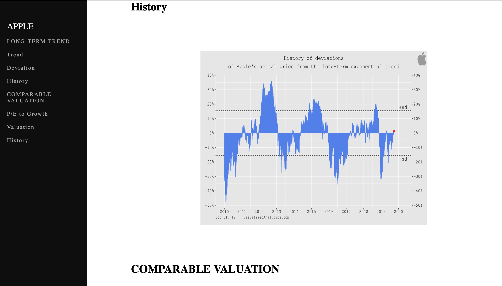

# Visualized-Analytics-Variant
This project is an imitation of a website, www.visualizedanalytics.com, where I focused on the redesigning of the webpages of the visualized analytics website with the help of my knowledge, resources, and skills.

The project consists of the following: 

- A home page (where it shows the title, and the button "Get Started" )

- Once you click "Get Started", a webpage that displays markets will come up (such as stocks, commodities, indices, etc.), 
  but for my project, I made only "stocks" accessible. 
  
  

- Once you click stocks, a webpage that displays stocks will come up (I only chose "Apple" for my project), but the original website has a display of companies. 

- Once you click AAPL, a webpage will come up displaying the data of the company, such as the long-term trend (trend, deviation, history), and the comparable valuation (P/E to Growth Forward, Valuation, and History).

On the navigation bar above, there are two buttons, the "login", and the "subscribe". 
With an account, and a subscription plan, you can have access to updated information. 

But I only focused on the design aspect of it. 

You can login by typing your Email and Password, or you can reset your password if you forgot it.

You can subscribe by picking a subscription plan from the three options displayed, and the buttons will enable when you click on the checkbox that prints "I have read and accept";

and once you click on one of the buttons, it will take you to the register page, where you register for an account. You can register by entering your name, Email, Password, and confirm your password. 

